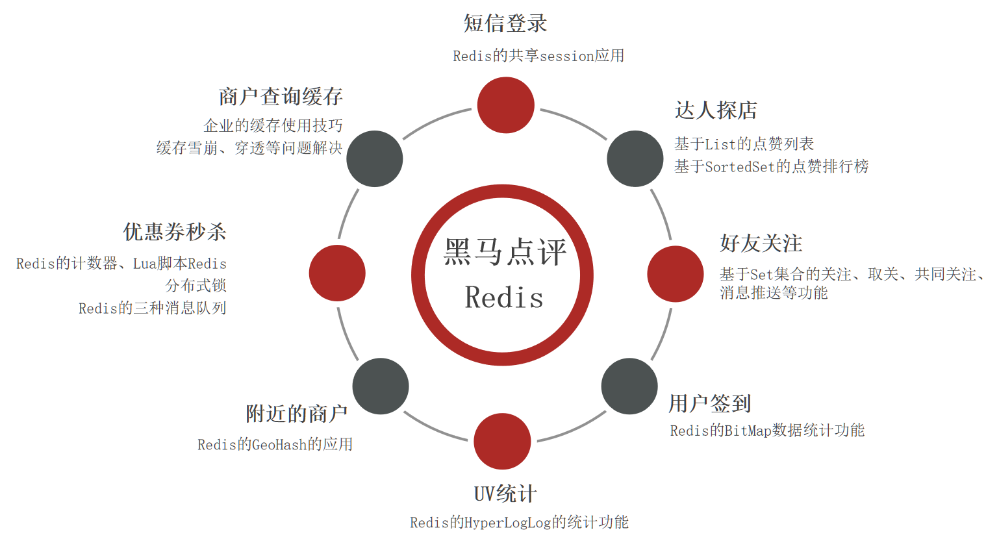

# Redis黑马视频教程项目

## 介绍
本章节是基于黑马程序员视频课程的学习笔记，其中涵盖项目实现、流程分析、各个方法的介绍、最后会带上完整的代码实现（gitee获取）！本章节会持续更新，于今日2022-6-28开始...

## 博客地址
本人的博客路径(含代码解析)：https://blog.csdn.net/weixin_43715214/article/details/125505311 
BiliBili视频的路径：https://www.bilibili.com/video/BV1cr4y1671t

#### 软件架构

## 仓库结构
本文完全依照黑马程序员课程目录，依次用Redis实现：

1. Redis基础知识&&数据结构
1. 短信登入
1. 商户查询缓存
1. 优惠券秒杀
1. 达人探店
1. 好友关注
1. 附近商户
1. 用户签到
1. UV统计

#### 安装教程

1.  xxxx
2.  xxxx
3.  xxxx

#### 使用说明

1.  xxxx
2.  xxxx
3.  xxxx

#### 参与贡献

1.  Fork 本仓库
2.  新建 Feat_xxx 分支
3.  提交代码
4.  新建 Pull Request

